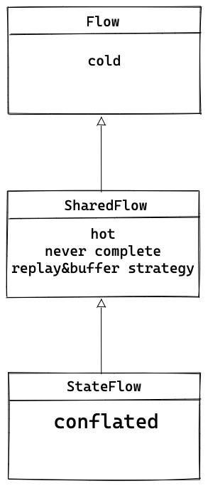

# Kotlin Flows

本文包含的内容:
* Flow是什么, 基本概念和用法.
* Flow的不同类型, StateFlow和SharedFlow比较.
* Flow在Android中的使用
    - 安全收集.
    - 操作符`stateIn`, `shareIn`的用法和区别.

## Coroutines Flow Basics
### Flow是什么
Flow可以按顺序发送多个值, 概念上是一个数据流, 发射的值必须是同一个类型.
Flow使用suspend方法来生产/消费值, 数据流可以做异步计算.

几个基本知识点:
* 创建flow: 通过[flow builders](https://kotlin.github.io/kotlinx.coroutines/kotlinx-coroutines-core/kotlinx.coroutines.flow/-flow/)
* Flow数据流通过`emit()`来发射元素.
* 可以通过各种操作符对flow的数据进行处理. 注意中间的操作符都不会触发flow的数据发送.
* Flow默认是cold flow, 即需要通过被观察才能激活, 最常用的操作符是`collect()`.
* Flow的`CoroutineContext`, 不指定的情况下是`collect()`的`CoroutineContext`, 如果想要更改, 用[flowOn](https://kotlin.github.io/kotlinx.coroutines/kotlinx-coroutines-core/kotlinx.coroutines.flow/flow-on.html)
改之前的.

关于Flow的基本用法, 19年底写的这篇[coroutines flow in Android](./15-coroutines-flow-in-Android.md)可以温故知新.

### Flow的操作符
一个Flow操作符的可视化小网站: [FlowMarbles](https://flowmarbles.com/).

## Flow的不同类型
### SharedFlow and StateFlow
应用程序里比较常用的类型是SharedFlow和StateFlow. 
Android官方有一篇专门的文档来介绍二者: [StateFlow and SharedFlow ](https://developer.android.com/kotlin/flow/stateflow-and-sharedflow)
StateFlow继承于SharedFlow, SharedFlow继承于Flow.

基本关系如下:




* [Flow](https://kotlin.github.io/kotlinx.coroutines/kotlinx-coroutines-core/kotlinx.coroutines.flow/-flow/)
基类. Cold.
Flow的两大特性: Context preservation; Exception transparency.

* [SharedFlow](https://kotlin.github.io/kotlinx.coroutines/kotlinx-coroutines-core/kotlinx.coroutines.flow/-shared-flow/index.html)
继承Flow, 是一种hot flow, 所有collectors共享它的值, 永不终止, 是一种广播的方式. 
一个shared flow上的活跃collector被叫作subscriber.

在sharedFlow上的collect call永远不会正常complete, 还有Flow.launchIn.
可以配置replay and buffer overflow strategy.

如果subscriber suspend了, sharedflow会suspend这个stream, buffer这个要发射的元素, 等待subscriber resume.
Because onBufferOverflow is set with `BufferOverflow.SUSPEND`, the flow will suspend until it can deliver the event to all subscribers.

默认参数:
```kotlin
public fun <T> MutableSharedFlow(
    replay: Int = 0,
    extraBufferCapacity: Int = 0,
    onBufferOverflow: BufferOverflow = BufferOverflow.SUSPEND
)
```
total buffer是: `replay + extraBufferCapacity`.
如果total buffer是0, 那么onBufferOverflow只能是`onBufferOverflow = BufferOverflow.SUSPEND`.

关于reply和buffer, 这个[文章](https://www.raywenderlich.com/22030171-reactive-streams-on-kotlin-sharedflow-and-stateflow#toc-anchor-005)
有详细的解释, 并且配有动图.

* [StateFlow](https://kotlin.github.io/kotlinx.coroutines/kotlinx-coroutines-core/kotlinx.coroutines.flow/-state-flow/index.html)
继承SharedFlow, hot flow, 和是否有collector收集无关, 永不complete.

可以通过`value`属性访问当前值.
有conflated特性, 会跳过太快的更新, 永远返回最新值.
Strong equality-based conflation: 会通过`equals()`来判断值是否发生改变, 如果没有改变, 则不会通知collector.
因为conflated的特性, StateFlow赋值的时候要注意使用不可变的值.

#### cold vs hot
cold stream 可以重复收集, 每次收集, 会对每一个收集者单独开启一次.
hot stream 永远发射不同的值, 和是否有人收集无关, 永远不会终止.

* [sharedIn](https://kotlin.github.io/kotlinx.coroutines/kotlinx-coroutines-core/kotlinx.coroutines.flow/share-in.html)
可以把cold flow转成hot的SharedFlow.
* [stateIn](https://kotlin.github.io/kotlinx.coroutines/kotlinx-coroutines-core/kotlinx.coroutines.flow/state-in.html)
可以把cold flow转成hot的StateFlow.

#### StateFlow vs SharedFlow
共性:
* `StateFlow`和`SharedFlow`永远都不会停止. 不能指望它们的`onCompletionCallback`.

不同点:
* `StateFlow`可以通过`value`属性读到最新的值, 但`SharedFlow`却不行.
* `StateFlow`是conflated: 如果新的值和旧的值一样, 不会传播.
* `SharedFlow`需要合理设置buffer和replay策略.

互相转换:
`SharedFlow`用了`distinctUntilChanged`以后变成`StateFlow`.

```kotlin
// MutableStateFlow(initialValue) is a shared flow with the following parameters:
val shared = MutableSharedFlow(
    replay = 1,
    onBufferOverflow = BufferOverflow.DROP_OLDEST
)
shared.tryEmit(initialValue) // emit the initial value
val state = shared.distinctUntilChanged() // get StateFlow-like behavior
```

RxJava的等价替代:
* `PublishSubject` -> `SharedFlow`.
* `BehaviorSubject` -> `StateFlow`.

## Use Flow in Android
### 发送事件(Event或Effects): SharedFlow
因为SharedFlow没有conflated特性, 所以适合发送事件, 即便值变化得快也是每个都发送.
```kotlin
private val _sharedViewEffects = MutableSharedFlow<SharedViewEffects>() // 1
val sharedViewEffects = _sharedViewEffects.asSharedFlow() // 2
```
这里用了`asSharedFlow`来创建一个`ReadonlySharedFlow`.

SharedFlow发射元素有两个方法:
* `emit`: suspend方法.
* `tryEmit`: 非suspend方法.

因为`tryEmit`是非suspend的, 适用于有buffer的情况.

### 保存暴露UI状态: StateFlow
`StateFlow`是一个state-holder, 可以通过`value`读到当前状态值.
一般会有一个`MutableStateFlow`类型的Backing property.

`StateFlow`是hot的, collect并不会触发producer code.
当有新的consumer时, 新的consumer会接到上次的状态和后续的状态.

使用StateFlow时, 发射新元素只需要赋值:
```kotlin
mutableState.value = newState
```
注意这里新值和旧的值要`equals`判断不相等才能发射出去.

### StateFlow vs LiveData
`StateFlow`和`LiveData`很像.

`StateFlow`和`LiveData`的相同点:
* 永远有一个值.
* 只有一个值.
* 支持多个观察者.
* 在订阅的瞬间, replay最新的值.

有一点点不同:
* `StateFlow`需要一个初始值.
* `LiveData`会自动解绑, flow要达到相同效果, collect要在`Lifecycle.repeatOnLifecycle`里.

### Flow的安全收集
关于收集Flow的方法, 主要还是关注一下生命周期的问题, 因为SharedFlow和StateFlow都是hot的.
在这个文章里有详细的讨论: [A safer way to collect flows from Android UIs](https://medium.com/androiddevelopers/a-safer-way-to-collect-flows-from-android-uis-23080b1f8bda)

在UI层收集的时候注意要用`repeatOnLifecycle`:
```kotlin
class LatestNewsActivity : AppCompatActivity() {
    private val latestNewsViewModel = // getViewModel()

    override fun onCreate(savedInstanceState: Bundle?) {
        //...
        // Start a coroutine in the lifecycle scope
        lifecycleScope.launch {
            // repeatOnLifecycle launches the block in a new coroutine every time the
            // lifecycle is in the STARTED state (or above) and cancels it when it's STOPPED.
            repeatOnLifecycle(Lifecycle.State.STARTED) {
                // Trigger the flow and start listening for values.
                // Note that this happens when lifecycle is STARTED and stops
                // collecting when the lifecycle is STOPPED
                latestNewsViewModel.uiState.collect { uiState ->
                    // New value received
                    when (uiState) {
                        is LatestNewsUiState.Success -> showFavoriteNews(uiState.news)
                        is LatestNewsUiState.Error -> showError(uiState.exception)
                    }
                }
            }
        }
    }
}
```

这个[文章](https://proandroiddev.com/android-singleliveevent-redux-with-kotlin-flow-b755c70bb055)里有个扩展方法也挺好的:
```kotlin
class FlowObserver<T> (
    lifecycleOwner: LifecycleOwner,
    private val flow: Flow<T>,
    private val collector: suspend (T) -> Unit
) {

    private var job: Job? = null

    init {
        lifecycleOwner.lifecycle.addObserver(LifecycleEventObserver {
                source: LifecycleOwner, event: Lifecycle.Event ->
            when (event) {
                Lifecycle.Event.ON_START -> {
                    job = source.lifecycleScope.launch {
                        flow.collect { collector(it) }
                    }
                }
                Lifecycle.Event.ON_STOP -> {
                    job?.cancel()
                    job = null
                }
                else -> { }
            }
        })
    }
}


inline fun <reified T> Flow<T>.observeOnLifecycle(
    lifecycleOwner: LifecycleOwner,
    noinline collector: suspend (T) -> Unit
) = FlowObserver(lifecycleOwner, this, collector)

inline fun <reified T> Flow<T>.observeInLifecycle(
    lifecycleOwner: LifecycleOwner
) = FlowObserver(lifecycleOwner, this, {})
```

看了一下官方的`repeatOnLifecycle`其实大概也是这个意思:
```kotlin
public suspend fun Lifecycle.repeatOnLifecycle(
    state: Lifecycle.State,
    block: suspend CoroutineScope.() -> Unit
) {
    require(state !== Lifecycle.State.INITIALIZED) {
        "repeatOnLifecycle cannot start work with the INITIALIZED lifecycle state."
    }

    if (currentState === Lifecycle.State.DESTROYED) {
        return
    }

    // This scope is required to preserve context before we move to Dispatchers.Main
    coroutineScope {
        withContext(Dispatchers.Main.immediate) {
            // Check the current state of the lifecycle as the previous check is not guaranteed
            // to be done on the main thread.
            if (currentState === Lifecycle.State.DESTROYED) return@withContext

            // Instance of the running repeating coroutine
            var launchedJob: Job? = null

            // Registered observer
            var observer: LifecycleEventObserver? = null
            try {
                // Suspend the coroutine until the lifecycle is destroyed or
                // the coroutine is cancelled
                suspendCancellableCoroutine<Unit> { cont ->
                    // Lifecycle observers that executes `block` when the lifecycle reaches certain state, and
                    // cancels when it falls below that state.
                    val startWorkEvent = Lifecycle.Event.upTo(state)
                    val cancelWorkEvent = Lifecycle.Event.downFrom(state)
                    val mutex = Mutex()
                    observer = LifecycleEventObserver { _, event ->
                        if (event == startWorkEvent) {
                            // Launch the repeating work preserving the calling context
                            launchedJob = this@coroutineScope.launch {
                                // Mutex makes invocations run serially,
                                // coroutineScope ensures all child coroutines finish
                                mutex.withLock {
                                    coroutineScope {
                                        block()
                                    }
                                }
                            }
                            return@LifecycleEventObserver
                        }
                        if (event == cancelWorkEvent) {
                            launchedJob?.cancel()
                            launchedJob = null
                        }
                        if (event == Lifecycle.Event.ON_DESTROY) {
                            cont.resume(Unit)
                        }
                    }
                    this@repeatOnLifecycle.addObserver(observer as LifecycleEventObserver)
                }
            } finally {
                launchedJob?.cancel()
                observer?.let {
                    this@repeatOnLifecycle.removeObserver(it)
                }
            }
        }
    }
}

```
既然官方已经推出了, 我们就用官方的`repeatOnLifecycle`方法吧.

### `shareIn`和`stateIn`
前面提过这两个操作符是用来做flow转换的:
* [sharedIn](https://kotlin.github.io/kotlinx.coroutines/kotlinx-coroutines-core/kotlinx.coroutines.flow/share-in.html)
可以把cold flow转成hot的SharedFlow.
* [stateIn](https://kotlin.github.io/kotlinx.coroutines/kotlinx-coroutines-core/kotlinx.coroutines.flow/state-in.html)
可以把cold flow转成hot的StateFlow.

`shareIn`可以保证只有一个数据源被创造, 并且被所有collectors收集.
比如:
```kotlin
class LocationRepository(
    private val locationDataSource: LocationDataSource,
    private val externalScope: CoroutineScope
) {
    val locations: Flow<Location> = 
        locationDataSource.locationsSource.shareIn(externalScope, WhileSubscribed())
}
```
`WhileSubscribed`这个策略是说, 当无人观测时, 上游的flow就被取消.

实际使用时可以用`WhileSubscribed(5000)`, 让上游的flow即便在无人观测的情况下, 也能继续保持5秒.
这样可以在某些情况(比如旋转屏幕)时避免重建上游资源, 适用于上游资源创建起来很expensive的情况.

如果我们的需求是, 永远保持一个最新的cache值.
```kotlin

class LocationRepository(
    private val locationDataSource: LocationDataSource,
    private val externalScope: CoroutineScope
) {
    val locations: Flow<Location> = 
        locationDataSource.locationsSource.stateIn(externalScope, WhileSubscribed(), EmptyLocation)
}
```
`Flow.stateIn`将会缓存最后一个值, 并且有新的collector时, 将这个最新值传给它.

### `shareIn`, `stateIn`使用注意事项
永远不要在方法里面调用`shareIn`和`stateIn`, 因为方法每次被调用, 它们都会创建新的流.
这些流没有被复用, 会存在内存里面, 直到scope被取消或者没有引用时被GC.

推荐的使用方式是在property上用:

```kotlin
class UserRepository(
    private val userLocalDataSource: UserLocalDataSource,
    private val externalScope: CoroutineScope
) {
    // DO NOT USE shareIn or stateIn in a function like this.
    // It creates a new SharedFlow/StateFlow per invocation which is not reused!
    fun getUser(): Flow<User> =
        userLocalDataSource.getUser()
            .shareIn(externalScope, WhileSubscribed())    

    // DO USE shareIn or stateIn in a property
    val user: Flow<User> = 
        userLocalDataSource.getUser().shareIn(externalScope, WhileSubscribed())
}
```

### StateFlow使用总结
从ViewModel暴露数据到UI, 用`StateFlow`的两种方式:
1. 暴露一个StateFlow属性, 用`WhileSubscribed`加上一个timeout.
```kotlin
class MyViewModel(...) : ViewModel() {
    val result = userId.mapLatest { newUserId ->
        repository.observeItem(newUserId)
    }.stateIn(
        scope = viewModelScope, 
        started = WhileSubscribed(5000), 
        initialValue = Result.Loading
    )
}
```
2. 用`repeatOnLifecycle`收集.
```kotlin
onCreateView(...) {
    viewLifecycleOwner.lifecycleScope.launch {
        viewLifecycleOwner.lifecycle.repeatOnLifecycle(STARTED) {
            myViewModel.myUiState.collect { ... }
        }
    }
}
```

其他的组合都会保持上游的活跃, 浪费资源:
* 用`WhileSubscribed`暴露属性, 在`lifecycleScope.launch/launchWhenX`里收集.
* 通过`Lazily/Eagerly`暴露, 用`repeatOnLifecycle`收集.


## References
* [Kotlin flows on Android](https://developer.android.com/kotlin/flow)
* [StateFlow and SharedFlow](https://developer.android.com/kotlin/flow/stateflow-and-sharedflow)
* [A safer way to collect flows from Android UIs](https://medium.com/androiddevelopers/a-safer-way-to-collect-flows-from-android-uis-23080b1f8bda)
* [Things to know about Flow’s shareIn and stateIn operators](https://medium.com/androiddevelopers/things-to-know-about-flows-sharein-and-statein-operators-20e6ccb2bc74)
* [Shared flows, broadcast channels](https://elizarov.medium.com/shared-flows-broadcast-channels-899b675e805c)
* [Kotlin SharedFlow or: How I learned to stop using RxJava and love the Flow](https://proandroiddev.com/kotlin-sharedflow-or-how-i-learned-to-stop-using-rxjava-and-love-the-flow-e1b59d211715)
* [Migrating from LiveData to Kotlin’s Flow](https://medium.com/androiddevelopers/migrating-from-livedata-to-kotlins-flow-379292f419fb)
* [Substituting Android’s LiveData: StateFlow or SharedFlow?](https://proandroiddev.com/should-we-choose-kotlins-stateflow-or-sharedflow-to-substitute-for-android-s-livedata-2d69f2bd6fa5)
* [Learning State & Shared Flows with Unit Tests](https://codingwithmohit.com/coroutines/learning-shared-and-state-flows-with-tests/)
* [Reactive Streams on Kotlin: SharedFlow and StateFlow](https://www.raywenderlich.com/22030171-reactive-streams-on-kotlin-sharedflow-and-stateflow)
* [Reading Coroutine official guide thoroughly — Part 0](https://myungpyo.medium.com/reading-coroutine-official-guide-thoroughly-part-0-942c4567f91a)