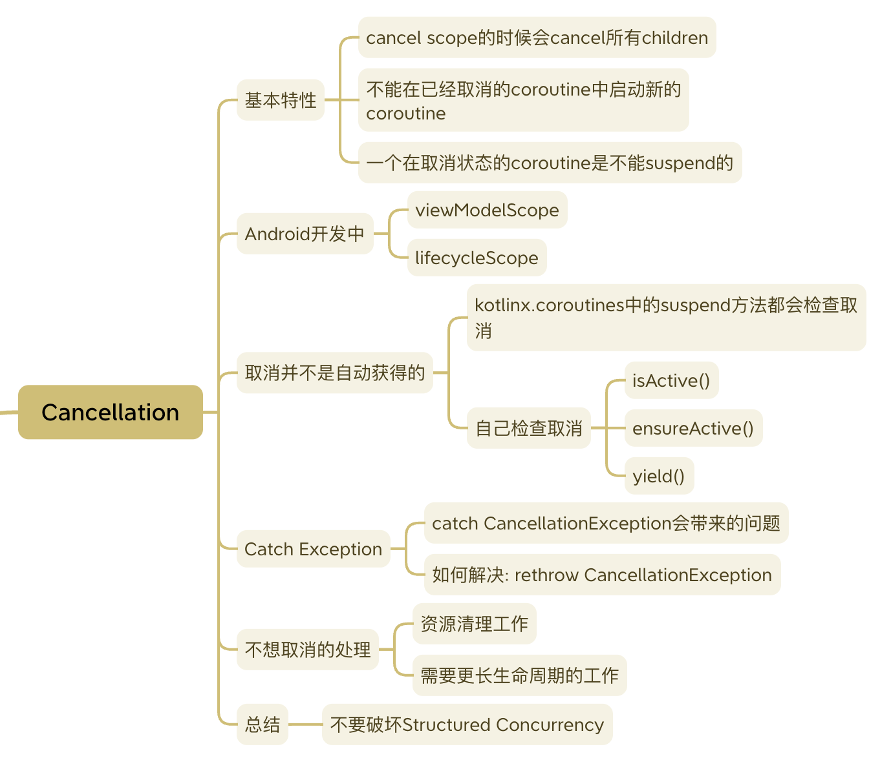

# 协程的取消
本文讨论协程的取消, 以及实现时可能会碰到的几个问题.



## 协程的取消
取消的意义: 避免资源浪费, 以及多余操作带来的问题.

基本特性:
- cancel scope的时候会cancel其中的所有child coroutines.
- 一旦取消一个scope, 你将不能再在其中launch新的coroutine.
- 一个在取消状态的coroutine是不能suspend的.

如果一个coroutine抛出了异常, 它将会把这个exception向上抛给它的parent, 它的parent会做以下三件事情:
- 取消其他所有的children.
- 取消自己.
- 把exception继续向上传递.


## Android开发中的取消
在Android开发中, 比较常见的情形是由于View生命周期的终止, 我们需要取消一些操作.

通常我们不需要手动调用`cancel()`方法, 那是因为我们利用了一些更高级的包装方法, 比如:
- `viewModelScope`: 会在ViewModel onClear的时候cancel.
- `lifecycleScope`: 会在作为Lifecycle Owner的View对象: Activity, Fragment到达DESTROYED状态时cancel.


## 取消并不是自动获得的
all suspend functions from `kotlinx.coroutines` are cancellable, but not yours.

kotlin官方提供的suspend方法都会有cancel的处理, 但是我们自己写的suspend方法就需要自己留意.
尤其是耗时或者带循环的地方, 通常需要自己加入检查, 否则即便调用了cancel, 代码也继续在执行.

有这么几种方法:
- `isActive()`
- `ensureActive()`
- `yield()`: 除了ensureActive以外, 会出让资源, 比如其他工作不需要再往线程池里加线程.

一个在循环中检查coroutine是否依然活跃的例子:
```kotlin
fun main() = runBlocking {
    val startTime = currentTimeMillis()
    val job = launch(Dispatchers.Default) {
        var nextPrintTime = startTime
        var i = 0
        while (isActive) { // cancellable computation loop
            // print a message twice a second
            if (currentTimeMillis() >= nextPrintTime) {
                println("job: I'm sleeping ${i++} ...")
                nextPrintTime += 500L
            }
        }
    }
    delay(1300L) // delay a bit
    println("main: I'm tired of waiting!")
    job.cancelAndJoin() // cancels the job and waits for its completion
    println("main: Now I can quit.")
}
```


## catch Exception和runCatching
众所周知catch一个很general的`Exception`类型可能不是一个好做法.
因为你以为捕获了A, B, C异常, 结果实际上还有D, E, F.

捕获具体的异常类型, 在开发阶段的快速失败会帮助我们更早定位和解决问题.

协程还推出了一个"方便"的`runCatching`方法, catch`Throwable`.
让我们写出了看似更"保险", 但却更容易破坏取消机制的代码.

如果我们catch了`CancellationException`, 会破坏Structured Concurrency.
看这个例子:
```kotlin
fun main() = runBlocking {
    val job = launch(Dispatchers.Default) {
        println("my long time function start")
        myLongTimeFunction()
        println("my other operations ==== ") // this line should not be printed when cancelled
    }
    delay(1300L) // delay a bit
    println("main: I'm tired of waiting!")
    job.cancelAndJoin() // cancels the job and waits for its completion
    println("main: Now I can quit.")
}

private suspend fun myLongTimeFunction() = runCatching {
    var i = 0
    while (i < 10) {
        // print a message twice a second
        println("job: I'm sleeping ${i++} ...")
        delay(500)
    }
}
```
当job cancel了以后后续的工作不应该继续进行, 然而我们可以看到log仍然被打印出来, 这是因为`runCatching`把异常全都catch了.


这里有个open issue讨论这个问题: https://github.com/Kotlin/kotlinx.coroutines/issues/1814


### CancellationException的特殊处理
如何解决上面的问题呢? 基本方案是把`CancellationException`再throw出来.

比如对于runCatching的改造, NowInAndroid里有这么一个方法[suspendRunCatching](https://github.com/android/nowinandroid/blob/607c24e7f7399942e278af663ea4ad350e5bbc3a/core/data/src/main/java/com/google/samples/apps/nowinandroid/core/data/SyncUtilities.kt#L57):

```kotlin
private suspend fun <T> suspendRunCatching(block: suspend () -> T): Result<T> = try {
    Result.success(block())
} catch (cancellationException: CancellationException) {
    throw cancellationException
} catch (exception: Exception) {
    Log.i(
        "suspendRunCatching",
        "Failed to evaluate a suspendRunCatchingBlock. Returning failure Result",
        exception
    )
    Result.failure(exception)
}
```
上面的例子改为用这个`suspendRunCatching`方法替代`runCatching`就修好了.

## 不想取消的处理
可能还有一些工作我们不想随着job的取消而完全取消.

### 资源清理工作
finally通常用于try block之后的的资源清理, 如果其中没有suspend方法那么没有问题.

如果finally中的代码是suspend的, 如前所述, 一个在取消状态的coroutine是不能suspend的.
那么需要用一个`withContext(NonCancellable)`.

例子:
```kotlin
fun main() = runBlocking {
    val job = launch {
        try {
            repeat(1000) { i ->
                println("job: I'm sleeping $i ...")
                delay(500L)
            }
        } finally {
            withContext(NonCancellable) {
                println("job: I'm running finally")
                delay(1000L)
                println("job: And I've just delayed for 1 sec because I'm non-cancellable")
            }
        }
    }
    delay(1300L) // delay a bit
    println("main: I'm tired of waiting!")
    job.cancelAndJoin() // cancels the job and waits for its completion
    println("main: Now I can quit.")
}
```

注意这个方法一般用于会suspend的资源清理, 不建议在各个场合到处使用, 因为它破坏了对coroutine执行取消的控制.

### 需要更长生命周期的工作
如果有一些工作需要比View/ViewModel更长的生命周期, 可以把它放在更下层, 用一个生命周期更长的scope. 
可以根据不同的场景设计, 比如可以用一个application生命周期的scope:

```kotlin
class MyApplication : Application() {
  // No need to cancel this scope as it'll be torn down with the process
  val applicationScope = CoroutineScope(SupervisorJob() + otherConfig)
}
```
再把这个scope注入到repository中去.

如果需要做的工作比application的生命周期更长, 那么可以考虑用`WorkManager`.


## 总结: 不要破坏Structured Concurrency
Structure Concurrency为开发者提供了方便管理多个coroutines的有效方法.
基本上破坏Structure Concurrency特性的行为(比如用GlobalScope, 用NonCancellable, catch CancellationException等)都是反模式, 要小心使用.

还要注意不要随便传递job.
`CoroutineContext`有一个元素是job, 但是这并不意味着我们可以像切Dispatcher一样随便传一个job参数进去.
文章: [Structured Concurrency Anniversary](https://elizarov.medium.com/structured-concurrency-anniversary-f2cc748b2401)

看这里: https://github.com/Kotlin/kotlinx.coroutines/issues/1001


## References & Further Reading
Kotlin官方文档的网页版和markdown版本:
- [Cancellation and timeouts](https://kotlinlang.org/docs/cancellation-and-timeouts.html)
- [Cancelling and timeouts github md version](https://github.com/Kotlin/kotlinx.coroutines/blob/master/docs/topics/cancellation-and-timeouts.md)

Android官方文档上链接的博客和视频:
- [Cancellation in coroutines](https://medium.com/androiddevelopers/cancellation-in-coroutines-aa6b90163629)
- [KotlinConf 2019: Coroutines! Gotta catch 'em all! by Florina Muntenescu & Manuel Vivo](https://www.youtube.com/watch?v=w0kfnydnFWI)

其他:
- [Coroutines: first things first](https://medium.com/androiddevelopers/coroutines-first-things-first-e6187bf3bb21)
- [Kotlin Coroutines and Flow - Use Cases on Android](https://github.com/LukasLechnerDev/Kotlin-Coroutines-and-Flow-UseCases-on-Android)
- [Structured Concurrency Anniversary](https://elizarov.medium.com/structured-concurrency-anniversary-f2cc748b2401)
- [Exceptions in coroutines](https://medium.com/androiddevelopers/exceptions-in-coroutines-ce8da1ec060c)
- [Coroutines & Patterns for work that shouldn’t be cancelled](https://medium.com/androiddevelopers/coroutines-patterns-for-work-that-shouldnt-be-cancelled-e26c40f142ad)

