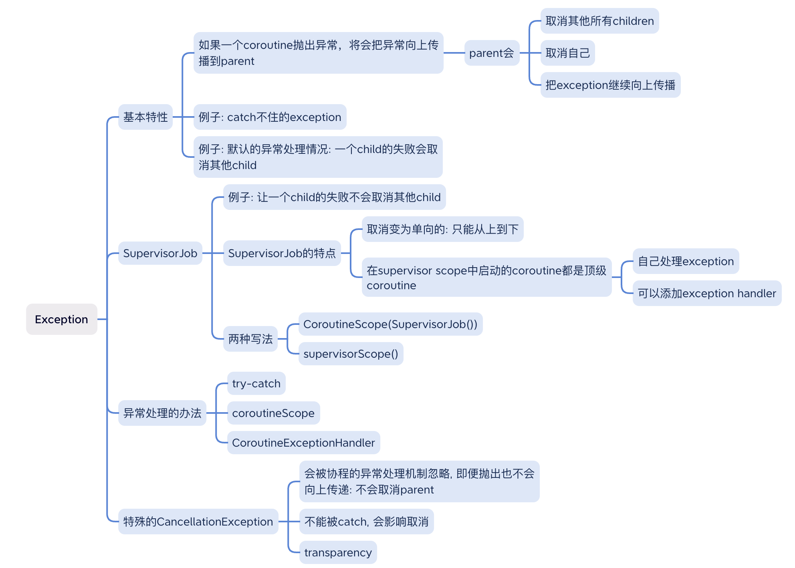

# 协程中的异常处理



## Parent-Child关系
如果一个coroutine抛出了异常, 它将会把这个exception向上抛给它的parent, 它的parent会做一下三件事情:
- 取消其他所有的children.
- 取消自己.
- 把exception继续向上传递.

这是默认的异常处理关系, 取消是双向的, child会取消parent, parent会取消所有child.

### catch不住的exception
看这个代码片段:
```kotlin
fun main() {
    val scope = CoroutineScope(Job())
    try {
        scope.launch {
            throw RuntimeException()
        }
    } catch (e: Exception) {
        println("Caught: $e")
    }

    Thread.sleep(100)
}
```
这里的异常catch不住了.
会直接让main函数的主进程崩掉.

这是因为和普通的异常处理机制不同, coroutine中未被处理的异常并不是直接抛出, 而是按照job hierarchy向上传递给parent.

如果把try放在launch里面还行.

### 默认的异常处理
默认情况下, child发生异常, parent和其他child也会被取消.
```kotlin
fun main() {
    println("start")
    val exceptionHandler = CoroutineExceptionHandler { _, exception ->
        println("CoroutineExceptionHandler got $exception")
    }
    val scope = CoroutineScope(Job() + exceptionHandler)

    scope.launch {
        println("child 1")
        delay(1000)
        println("finish child 1")
    }.invokeOnCompletion { throwable ->
        if (throwable is CancellationException) {
            println("Coroutine 1 got cancelled!")
        }
    }

    scope.launch {
        println("child 2")
        delay(100)
        println("child 2 throws exception")
        throw RuntimeException()
    }

    Thread.sleep(2000)
    println("end")
}
```
打印出:
```
start
child 1
child 2
child 2 throws exception
Coroutine 1 got cancelled!
CoroutineExceptionHandler got java.lang.RuntimeException
end
```

## SupervisorJob
如果有一些情形, 开启了多个child job, 但是却不想因为其中一个的失败而取消其他, 怎么办? 用`SupervisorJob`.

比如: 
```
val uiScope = CoroutineScope(SupervisorJob())
```

如果你用的是scope builder, 那么用`supervisorScope`.


用`SupervisorJob`改造上面的例子:
```kotlin
fun main() {
    println("start")
    val exceptionHandler = CoroutineExceptionHandler { _, exception ->
        println("CoroutineExceptionHandler got $exception")
    }
    val scope = CoroutineScope(SupervisorJob() + exceptionHandler)

    scope.launch {
        println("child 1")
        delay(1000)
        println("finish child 1")
    }.invokeOnCompletion { throwable ->
        if (throwable is CancellationException) {
            println("Coroutine 1 got cancelled!")
        }
    }

    scope.launch {
        println("child 2")
        delay(100)
        println("child 2 throws exception")
        throw RuntimeException()
    }
    Thread.sleep(2000)
    println("end")
}
```
输出:
```
start
child 1
child 2
child 2 throws exception
CoroutineExceptionHandler got java.lang.RuntimeException
finish child 1
end
```
尽管coroutine 2抛出了异常, 另一个coroutine还是做完了自己的工作.

### SupervisorJob的特点
`SupervisorJob`把取消变成了单向的, 只能从上到下传递, 只能parent取消child, 反之不能取消.
这样既顾及到了由于生命周期的结束而需要的正常取消, 又避免了由于单个的child失败而取消所有.

viewModelScope的context就是用了`SupervisorJob() + Dispatchers.Main.immediate`.

除了把取消变为单向的, `supervisorScope`也会和`coroutineScope`一样等待所有child执行结束.

在`supervisorScope`中直接启动的coroutine是顶级coroutine.
顶级coroutine的特性:
- 可以加exception handler.
- 自己处理exception.
比如上面的例子中coroutine child 2可以直接加exception handler.

使用注意事项, `SupervisorJob`只有两种写法: 
- 作为`CoroutineScope`的参数传入: `CoroutineScope(SupervisorJob())`.
- 使用`supervisorScope`方法.

把Job作为coroutine builder(比如launch)的参数传入是错误的做法, 不起作用, 因为一个新的coroutine总会assign一个新的Job.


## 异常处理的办法
### `try-catch`
和普通的异常处理一样, 我们可以用try-catch, 只是注意要再在coroutine里面:
```kotlin
fun main() {
    val scope = CoroutineScope(Job())
    scope.launch {
        try {
            throw RuntimeException()
        } catch (e: Exception) {
            println("Caught: $e")
        }
    }

    Thread.sleep(100)
}
```

这样就能打印出:
```
Caught: java.lang.RuntimeException
```

对于launch, try要包住整块.
对于async, try要包住await语句.

### scope function: coroutineScope()
`coroutineScope`会把其中未处理的exception抛出来.

相比较于这段代码中catch不到的exception:
```kotlin
fun main() {
    val scope = CoroutineScope(Job())
    scope.launch {
        try {
            launch {
                throw RuntimeException()
            }
        } catch (e: Exception) {
            println("Caught: $e")
        }
    }
    Thread.sleep(100)
}
```
没走到catch里, 仍然是主进程崩溃.

这个exception是可以catch到的:
```kotlin
fun main() {
    val scope = CoroutineScope(Job())
    scope.launch {
        try {
            coroutineScope {
                launch {
                    throw RuntimeException()
                }
            }
        } catch (e: Exception) {
            println("Caught: $e")
        }
    }

    Thread.sleep(100)
}
```
打印出:
```
Caught: java.lang.RuntimeException
```
因为这里`coroutineScope`把异常又重新抛出来了.

注意这里换成`supervisorScope`可是不行的.

### `CoroutineExceptionHandler`
`CoroutineExceptionHandler`是异常处理的最后一个机制, 此时coroutine已经结束了, 在这里的处理通常是报告log, 展示错误等.
如果不加exception handler那么unhandled exception会进一步往外抛, 如果最后都没人处理, 那么可能造成进程崩溃.

`CoroutineExceptionHandler`需要加在root coroutine上.

这是因为child coroutines会把异常处理代理到它们的parent, 后者继续代理到自己的parent, 一直到root.
所以对于非root的coroutine来说, 即便指定了`CoroutineExceptionHandler`也没有用, 因为异常不会传到它.


两个例外: 
- `async`的异常在`Deferred`对象中, `CoroutineExceptionHandler`也没有任何作用.
- supervision scope下的coroutine不会向上传递exception, 所以`CoroutineExceptionHandler`不用加在root上, 每个coroutine都可以加, 单独处理.

通过这个例子可以看出另一个特性: `CoroutineExceptionHandler`只有当所有child都结束之后才会处理异常信息.
```kotlin
@OptIn(DelicateCoroutinesApi::class)
fun main() = runBlocking {
    val handler = CoroutineExceptionHandler { _, exception -> 
        println("CoroutineExceptionHandler got $exception") 
    }
    val job = GlobalScope.launch(handler) {
        launch { // the first child
            try {
                delay(Long.MAX_VALUE)
            } finally {
                withContext(NonCancellable) {
                    println("Children are cancelled, but exception is not handled until all children terminate")
                    delay(100)
                    println("The first child finished its non cancellable block")
                }
            }
        }
        launch { // the second child
            delay(10)
            println("Second child throws an exception")
            throw ArithmeticException()
        }
    }
    job.join()
}
```
输出:
```
Second child throws an exception
Children are cancelled, but exception is not handled until all children terminate
The first child finished its non cancellable block
CoroutineExceptionHandler got java.lang.ArithmeticException
```

如果多个child都抛出异常, 只有第一个被handler处理, 其他都在`exception.suppressed`字段里.
```kotlin
fun main() = runBlocking {
    val handler = CoroutineExceptionHandler { _, exception ->
        println("CoroutineExceptionHandler got $exception with suppressed ${exception.suppressed.contentToString()}")
    }
    val job = GlobalScope.launch(handler) {
        launch {
            try {
                delay(Long.MAX_VALUE) // it gets cancelled when another sibling fails with IOException
            } finally {
                throw ArithmeticException() // the second exception
            }
        }
        launch {
            delay(100)
            throw IOException() // the first exception
        }
        delay(Long.MAX_VALUE)
    }
    job.join()
}
```
输出:
```
CoroutineExceptionHandler got java.io.IOException with suppressed [java.lang.ArithmeticException]
```

## 单独说一下async
async比较特殊:
- 作为top coroutine时, 在await的时候try-catch异常.
- 如果是非top coroutine, async块里的异常会被立即抛出.

例子:
```kotlin
fun main() {
    val scope = CoroutineScope(SupervisorJob())
    val deferred = scope.async {
        throw RuntimeException("RuntimeException in async coroutine")
    }

    scope.launch {
        try {
            deferred.await()
        } catch (e: Exception) {
            println("Caught: $e")
        }
    }

    Thread.sleep(100)
}
```
这里由于用了SupervisorJob, 所以async是top coroutine.

```kotlin
fun main() {

    val coroutineExceptionHandler = CoroutineExceptionHandler { coroutineContext, exception ->
        println("Handle $exception in CoroutineExceptionHandler")
    }

    val topLevelScope = CoroutineScope(SupervisorJob() + coroutineExceptionHandler)
    topLevelScope.launch {
        async {
            throw RuntimeException("RuntimeException in async coroutine")
        }
    }
    Thread.sleep(100)
}
```
当它不是top coroutine时, 异常会被直接抛出.

## 特殊的`CancellationException`
`CancellationException`是特殊的exception, 会被异常处理机制忽略, 即便抛出也不会向上传递, 所以不会取消它的parent.
但是`CancellationException`不能被catch, 如果它不被抛出, 其实协程没有被成功cancel, 还会继续执行.

CancellationException的透明特性:
如果`CancellationException`是由内部的其他异常引起的, 它会向上传递, 并且把原始的那个异常传递上去.
```kotlin
@OptIn(DelicateCoroutinesApi::class)
fun main() = runBlocking {
    val handler = CoroutineExceptionHandler { _, exception ->
        println("CoroutineExceptionHandler got $exception")
    }
    val job = GlobalScope.launch(handler) {
        val inner = launch { // all this stack of coroutines will get cancelled
            launch {
                launch {
                    throw IOException() // the original exception
                }
            }
        }
        try {
            inner.join()
        } catch (e: CancellationException) {
            println("Rethrowing CancellationException with original cause")
            throw e // cancellation exception is rethrown, yet the original IOException gets to the handler
        }
    }
    job.join()
}
```

输出:
```
Rethrowing CancellationException with original cause
CoroutineExceptionHandler got java.io.IOException
```
这里Handler拿到的是最原始的IOException.

## Further Reading

官方文档:
- [Coroutine exceptions handling](https://kotlinlang.org/docs/exception-handling.html)

Android官方文档上链接的博客和视频:
- [Exceptions in coroutines](https://medium.com/androiddevelopers/exceptions-in-coroutines-ce8da1ec060c)
- [KotlinConf 2019: Coroutines! Gotta catch 'em all! by Florina Muntenescu & Manuel Vivo](https://www.youtube.com/watch?v=w0kfnydnFWI)

其他:
- [Kotlin Coroutines and Flow - Use Cases on Android](https://github.com/LukasLechnerDev/Kotlin-Coroutines-and-Flow-UseCases-on-Android)
- [Why exception handling with Kotlin Coroutines is so hard and how to successfully master it!](https://www.lukaslechner.com/why-exception-handling-with-kotlin-coroutines-is-so-hard-and-how-to-successfully-master-it/)